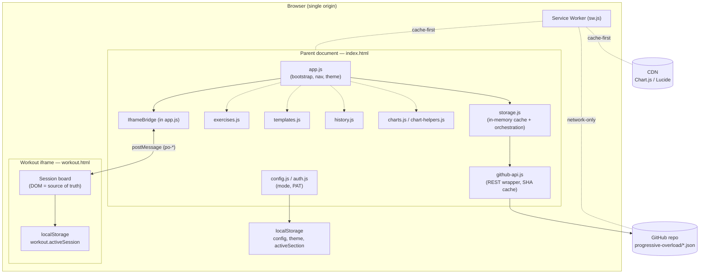
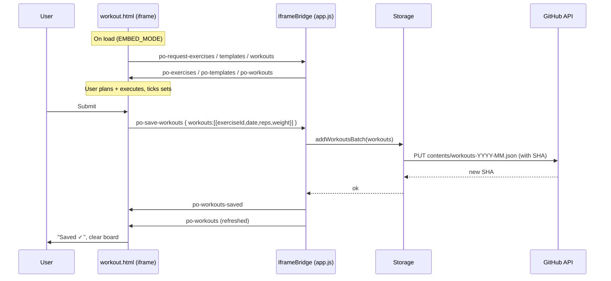
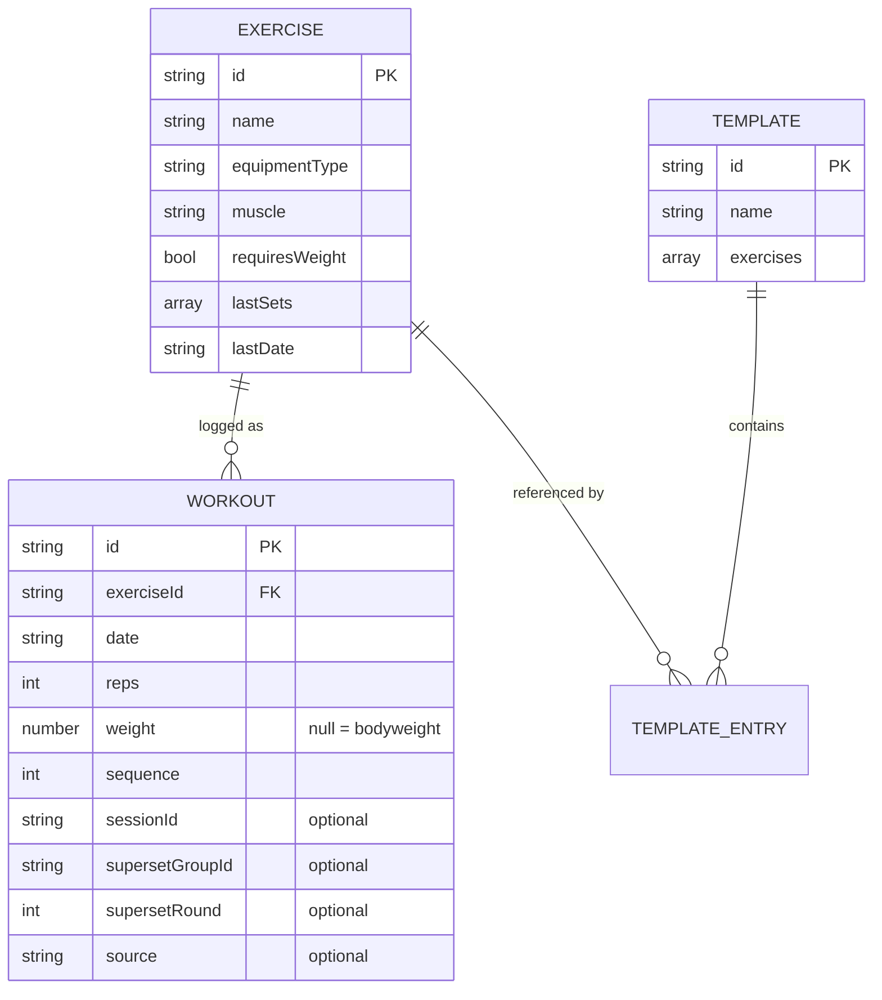
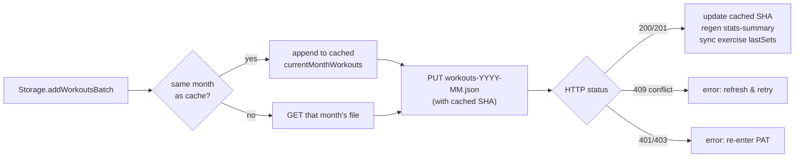
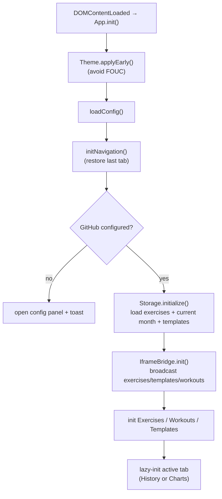

# Progressive Overload — System Design

> A full design document for the application **as it currently exists**. It
> describes the architecture, runtime topology, data model, key flows, and the
> trade-offs behind the major decisions. Diagrams are in Mermaid.

---

## 1. Overview

Progressive Overload is a **client-only Progressive Web App (PWA)** for tracking
strength-training progress. There is no application backend: the browser is the
entire runtime, and a **private GitHub repository is used as the database** via
the GitHub REST API. A tiny Node.js static file server exists only for local
development.

### Goals

- Log sets (reps × weight) quickly, plan whole sessions, and support supersets.
- Visualize progress: weekly volume by muscle, strength trends, 1RM, PRs.
- Sync across devices with zero server infrastructure to operate or pay for.
- Work offline and installable as a native-like app (PWA).

### Non-goals

- Multi-user accounts, sharing, or social features.
- A server-side API, server-side compute, or a managed database.
- Real-time collaboration / conflict-free multi-writer editing.

### Technology stack

| Concern | Choice |
|---|---|
| Language / UI | Vanilla JavaScript (ES6 modules), HTML5, CSS3 — no framework |
| Charts | Chart.js (only third-party runtime lib) |
| Icons | Lucide |
| Persistence | GitHub REST API (contents) + browser `localStorage` |
| Offline / install | Service Worker (`sw.js`) + Web App Manifest |
| Dev server | Node.js `http` static server (CommonJS) |

---

## 2. High-level architecture

The app runs in two coordinated browsing contexts in the same origin:

- **Parent document** (`index.html` + ES modules in `js/`) — owns navigation,
  configuration/auth, storage, charts, history, exercise & template management.
- **Workout iframe** (`workout.html`) — a self-contained mini-app that owns the
  live session board (plan → execute → submit). It has **no module access** and
  talks to the parent only through a `postMessage` bridge.



### Module responsibilities

| Module | Responsibility |
|---|---|
| `js/app.js` | App bootstrap, tab navigation (lazy-init History/Stats), theme system, and `IframeBridge` (the parent half of the workout bridge). |
| `js/config.js` | `CONFIG` constants + user config (mode, token, owner, repo) in `localStorage`. |
| `js/auth.js` | GitHub Personal Access Token (PAT) storage/retrieval. |
| `js/storage.js` | Central data layer: in-memory cache of exercises / current-month workouts / templates, sequence-number migration, stats-summary generation, last-set sync. |
| `js/github-api.js` | Thin GitHub REST wrapper: base64 encode/decode, SHA tracking, per-session file/dir cache. |
| `js/exercises.js` | Exercise CRUD UI (equipment types, muscle groups, filtering). |
| `js/templates.js` | Session template editor + loading templates into the planner. |
| `js/history.js` | Workout history rendering (week grouping, day modal). |
| `js/charts.js`, `js/chart-helpers.js` | Chart.js rendering: volume, 1RM, PRs, aggregation. |
| `js/workouts.js` | **Legacy.** Still imported/`init()`-ed but the planner DOM it targets no longer exists in the parent. Ignore for workout-tab changes. |
| `workout.html` | The live Workout tab (markup + inline script). The real planner. |
| `sw.js` | Offline cache + routing strategy. |
| `server.js` | Local-dev static file server only. |

---

## 3. Runtime topology & the iframe boundary

The single most important structural fact: **the Workout tab is a standalone
document embedded as an `<iframe>`**, not part of the parent module graph.

- The iframe **owns its DOM and treats the DOM as the source of truth** — there
  is no reactive state object. Snapshots are derived by serializing the DOM and
  restored by writing back into it.
- It has **no access** to `Storage`, `config`, or any module. Everything it
  needs (exercise list, templates, prior workouts) is **pushed in** over the
  `po-*` postMessage protocol, and the **only** way it writes data is by posting
  `po-save-workouts` back to the parent.
- It runs in two modes: `EMBED_MODE = window.self !== window.top`. Embedded =
  real app (bridge + real save). Standalone = demo (Submit just alerts).



### `po-*` message protocol

**Parent → iframe (push):** `po-exercises`, `po-templates`, `po-workouts`,
`po-workouts-saved`, `po-save-error`.
**Iframe → parent (request/action):** `po-request-exercises`,
`po-request-templates`, `po-request-workouts`, `po-save-workouts`.

Rules: only `po-`-prefixed messages are processed; the parent verifies
`event.source` is a known iframe; the target origin is `'*'`, so **secrets
(token/config) must never cross the bridge**; adding a message type requires
editing **both** ends.

---

## 4. Data model

All persisted data lives as JSON files in the GitHub repo under
`progressive-overload/`.



### Files on disk (in the repo)

| Path | Shape | Notes |
|---|---|---|
| `progressive-overload/exercises.json` | `{ exercises: Exercise[] }` | Single file, unbounded growth (≈ fine for ~50–100 exercises; GitHub contents API caps ~1 MB). |
| `progressive-overload/workouts-YYYY-MM.json` | `{ workouts: Workout[] }` | **Sharded by month** — the central scalability decision. Only the current month is loaded at startup; history/stats fetch ranges on demand. |
| `progressive-overload/session-templates.json` | `{ templates: Template[] }` | Reusable planned sessions. |
| `progressive-overload/stats-summary.json` | summary object | Pre-computed aggregate written on save to speed up stats. |

### Key field semantics

- **`weight: null`** means a bodyweight exercise (rendered as `BW`); a weight is
  never reintroduced for bodyweight movements.
- **`sequence`** orders workouts within a single day; assigned by
  `Storage.buildWorkoutRecord` / `addWorkoutsBatch` (the iframe sends a thin
  record without it). A one-time `migrateSequenceNumbers()` backfills older data.
- **Optional superset fields** (`supersetGroupId`, `supersetRound`) tie sets
  logged as a superset block together.

### Client-side state (`localStorage`)

| Key | Owner | Purpose |
|---|---|---|
| `app_config` | parent | mode, token, owner, repo |
| `github_pat` | parent | PAT fallback |
| `theme` | both | `light` / `dark` / `green`; synced into iframe via `storage` event |
| `activeSection` | parent | last open tab |
| `workout.activeSession` | iframe | in-progress session board (cards, sets, ticks) for refresh-restore |
| `workout1.lastWorkoutByExercise` | iframe | cached "previous set" hints |

---

## 5. Persistence & sync design

`Storage` (parent) is the orchestration layer over `GitHubAPI`:

- **In-memory cache** of exercises, current-month workouts, and templates is
  loaded once at `Storage.initialize()`.
- **`GitHubAPI`** wraps the REST contents endpoint: UTF-8-safe base64
  encode/decode, **per-session file/dir caches**, and **SHA tracking**. Every
  write is `PUT contents/<path>` including the file's current `sha`; GitHub
  rejects a stale SHA with **409**, surfaced to the user as "refresh and retry".
- **Concurrency model:** optimistic, last-writer-wins per file, guarded by the
  SHA. There is no merge — month-sharding keeps the blast radius of a conflict
  to a single month.



### Dual-mode storage

`config.mode` is `local` or `github`. GitHub mode syncs across devices using the
repo as the database; local mode keeps everything in the browser. The app boots
straight into the config panel if GitHub isn't configured.

---

## 6. Application flows

### Startup / bootstrap



- **Lazy tab init:** History and Statistics are only initialized on first visit
  (or if they're the restored active tab), keeping startup light.
- **Theme** is applied before paint to avoid a flash; toggling cycles
  light → dark → green and re-themes Chart.js defaults via a `themeChanged` event.

### Logging a session

Plan exercises/sets in the iframe → enter execute mode → tick completed sets →
Submit. Only **ticked** sets are sent. The parent enriches the thin records
(`id`, `sequence`), persists to the month file, regenerates the stats summary,
updates each exercise's `lastSets`/`lastDate`, then re-broadcasts workouts so the
board reflects the new "previous set" hints.

### History & statistics

- **History** groups saved workouts by week and renders a day modal.
- **Statistics** reads the pre-computed `stats-summary.json` and/or fetches
  workout months in range, then renders volume-by-muscle, strength trend, 1RM
  estimates, and PRs with Chart.js.

---

## 7. Offline / PWA design

`sw.js` implements a layered cache strategy:

| Resource | Strategy |
|---|---|
| Local app shell (HTML/JS/CSS/icons + `exercises.json`) | **Cache-first**, pre-cached on install |
| CDN (Chart.js, Lucide) | **Cache-first**, populated on first use |
| `api.github.com` | **Network-only** — never cached (data must be live) |

- A `CACHE_VERSION` bump (auto-incremented by a git hook on commit) invalidates
  stale caches on `activate`. Navigation requests fall back to cached
  `index.html` when offline.
- The Web App Manifest makes the app installable (standalone, portrait).

---

## 8. Security model

- **Auth = a GitHub PAT** with `repo` scope, stored in `localStorage` on the
  user's device. There is no server, so there is no server-side secret store.
- The token **never crosses the iframe bridge** (origin `'*'`); all GitHub calls
  happen in the parent.
- User-entered text is rendered with `textContent` (never `innerHTML`) to
  prevent XSS.
- **Implication:** anyone with access to the browser profile can read the PAT
  from `localStorage`. This is acceptable for a single-user, self-hosted-data
  tool but is the main security trade-off (see §9).

---

## 9. Trade-offs & rationale

| Decision | Benefit | Cost / risk |
|---|---|---|
| **GitHub repo as database (no backend)** | Zero infra to run/pay for; data is portable, versioned, and user-owned | Coupled to GitHub API rate limits; PAT lives client-side; optimistic concurrency only |
| **Workout tab as an isolated iframe** | Strong encapsulation; the planner is a self-contained app; DOM-as-truth keeps it simple | Must keep `po-*` protocol and serialize/restore pairs in sync on both ends; easy to "fix the wrong file" (`js/workouts.js`) |
| **Month-sharded workout files** | Small startup payload; bounded conflict scope; cheap range queries | Cross-month reports need multiple fetches; more files to manage |
| **No framework (vanilla JS modules)** | No build step, tiny dependency surface, fast load | Manual DOM wiring; object-literal singletons instead of components |
| **Pre-computed `stats-summary.json`** | Fast stats render without re-aggregating everything | Extra write on every save; can drift if hand-edited |
| **PAT in `localStorage`** | Simplest possible auth for a serverless app | Readable on the device; no token rotation/encryption |
| **Optimistic, SHA-guarded writes (last-writer-wins)** | Simple, no locking | Concurrent edits to the same month can 409; user must refresh & retry |

---

## 10. Known limitations & future directions

- **Legacy `js/workouts.js`** is dead for the live tab and should eventually be
  removed to avoid confusion.
- **`exercises.json` is unbounded** — a single-file model that will eventually
  hit the ~1 MB contents-API limit at extreme scale.
- **No real multi-writer conflict resolution** — fine for one user across
  devices used non-simultaneously.
- Possible evolutions: encrypt/scope the token (fine-grained PAT), shard or
  paginate exercises, add an export/backup flow, and formalize the stats-summary
  as a derived artifact regenerated from raw months.

---

## Appendix — file/directory map

```
index.html          Parent shell: nav, sections, workout <iframe>
workout.html        Live Workout tab (markup + inline script) ← the real planner
sw.js               Service Worker (offline cache + routing)
manifest.json       PWA manifest
server.js           Local-dev static server (CommonJS)
js/
  app.js            Bootstrap, nav, theme, IframeBridge
  config.js         CONFIG + user config (mode/token/owner/repo)
  auth.js           PAT storage
  storage.js        Data layer + orchestration
  github-api.js     GitHub REST wrapper (base64, SHA, caches)
  exercises.js      Exercise CRUD UI
  templates.js      Session templates
  history.js        Workout history UI
  charts.js         Chart.js rendering
  chart-helpers.js  Aggregation / 1RM / PR helpers
  workouts.js       LEGACY (do not use for tab changes)
progressive-overload/
  exercises.json            { exercises: [...] }
  workouts-YYYY-MM.json     { workouts: [...] }  (month-sharded)
  session-templates.json    { templates: [...] }
  stats-summary.json        pre-computed aggregates
css/                layout.css, components.css, styles.css
Doc/                UI + design documentation (this file)
```
