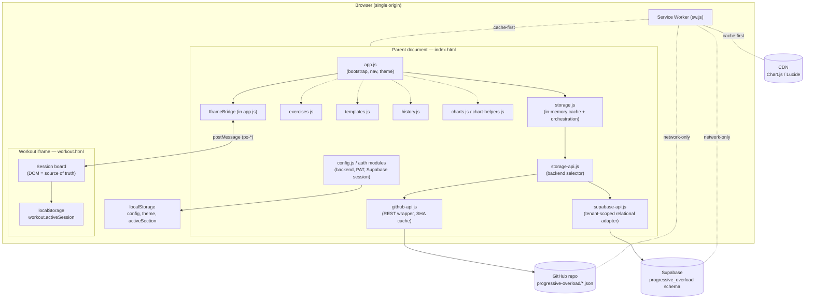
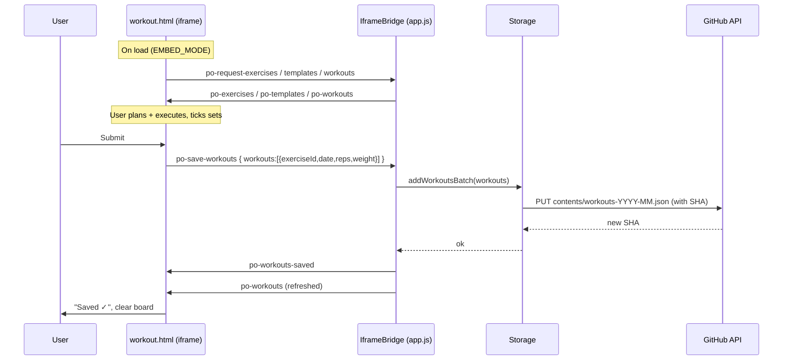
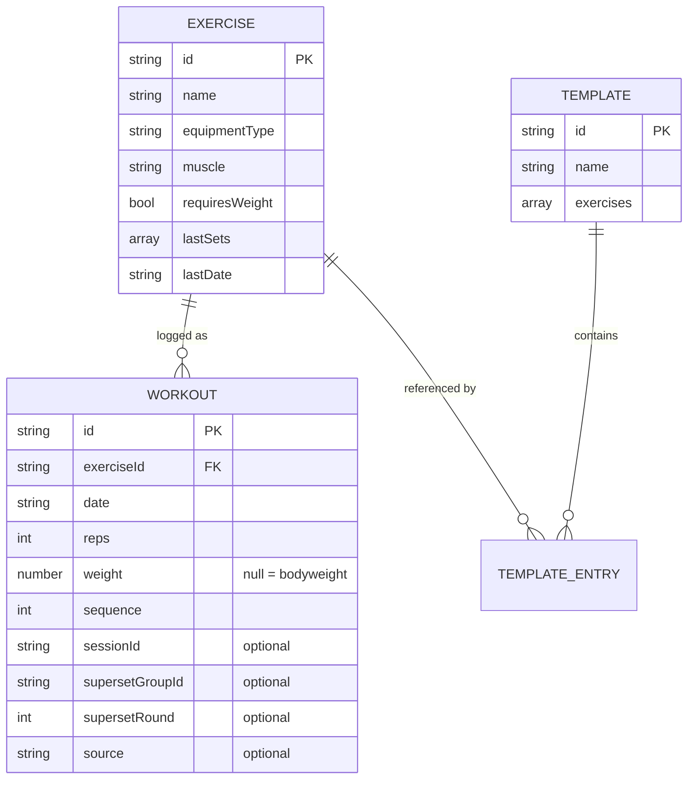
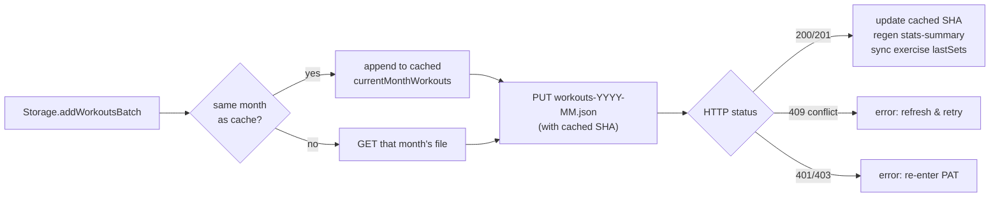
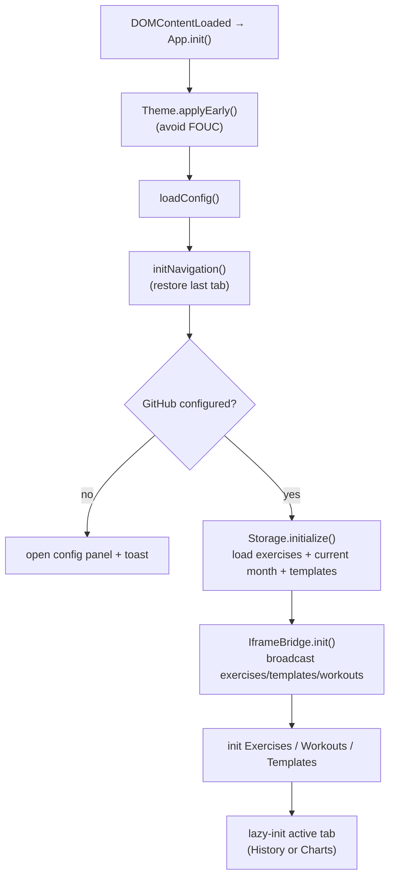

# Progressive Overload — System Design

> A full design document for the application **as it currently exists**. It
> describes the architecture, runtime topology, data model, key flows, and the
> trade-offs behind the major decisions. Diagrams are in Mermaid.

---

## 1. Overview

Progressive Overload is a **client-only Progressive Web App (PWA)** for tracking
strength-training progress. The browser is the application runtime and can use
either a tenant-isolated **Supabase Postgres/Auth backend** or the legacy private
GitHub JSON backend through the same `Storage` interface. A tiny Node.js static
file server exists only for local development.

### Goals

- Log sets (reps × weight) quickly, plan whole sessions, and support supersets.
- Visualize progress: weekly volume by muscle, strength trends, 1RM, PRs.
- Sync securely across devices with per-user data isolation.
- Work offline and installable as a native-like app (PWA).

### Non-goals

- Multi-user accounts, sharing, or social features.
- A server-side API, server-side compute, or a managed database.
- Real-time collaboration / conflict-free multi-writer editing.

### Technology stack

| Concern | Choice |
|---|---|
| Language / UI | Vanilla JavaScript (ES6 modules), HTML5, CSS3 — no framework |
| Charts | Chart.js (only third-party runtime lib) |
| Icons | Lucide |
| Persistence | GitHub REST API (contents) + browser `localStorage` |
| Offline / install | Service Worker (`sw.js`) + Web App Manifest |
| Dev server | Node.js `http` static server (CommonJS) |

---

## 2. High-level architecture

The app runs in two coordinated browsing contexts in the same origin:

- **Parent document** (`index.html` + ES modules in `js/`) — owns navigation,
  configuration/auth, storage, charts, history, exercise & template management.
- **Workout iframe** (`workout.html`) — a self-contained mini-app that owns the
  live session board (plan → execute → submit). It has **no module access** and
  talks to the parent only through a `postMessage` bridge.


```mermaid
graph TB
    subgraph Browser["Browser (single origin)"]
        subgraph Parent["Parent document — index.html"]
            App["app.js<br/>(bootstrap, nav, theme)"]
            Cfg["config.js / auth modules<br/>(backend, PAT, Supabase session)"]
            Store["storage.js<br/>(in-memory cache + orchestration)"]
            Adapter["storage-api.js<br/>(backend selector)"]
            GH["github-api.js<br/>(REST wrapper, SHA cache)"]
            SB["supabase-api.js<br/>(tenant-scoped relational adapter)"]
            Ex["exercises.js"]
            Tmpl["templates.js"]
            Hist["history.js"]
            Charts["charts.js / chart-helpers.js"]
            Bridge["IframeBridge (in app.js)"]
        end
        subgraph Frame["Workout iframe — workout.html"]
            Board["Session board<br/>(DOM = source of truth)"]
            LS2["localStorage<br/>workout.activeSession"]
        end
        SW["Service Worker (sw.js)"]
        LS1["localStorage<br/>config, theme, activeSection"]
    end

    GHREPO[("GitHub repo<br/>progressive-overload/*.json")]
    SUPABASE[("Supabase<br/>progressive_overload schema")]
    CDN[("CDN<br/>Chart.js / Lucide")]

    App --> Store --> Adapter
    Adapter --> GH --> GHREPO
    Adapter --> SB --> SUPABASE
    App --> Bridge
    Bridge <-->|"postMessage (po-*)"| Board
    Board --> LS2
    Cfg --> LS1
    App -.-> Ex & Tmpl & Hist & Charts
    SW -. cache-first .- CDN
    SW -. cache-first .- Parent
    SW -. network-only .- GHREPO
    SW -. network-only .- SUPABASE
```

### Module responsibilities

| Module | Responsibility |
|---|---|
| `js/app.js` | App bootstrap, tab navigation (lazy-init History/Stats), theme system, and `IframeBridge` (the parent half of the workout bridge). |
| `js/config.js` | `CONFIG` constants + selected storage backend and legacy GitHub configuration in `localStorage`. |
| `js/auth.js`, `js/supabase-auth.js` | GitHub PAT compatibility plus Supabase email magic-link sessions. |
| `js/storage.js` | Central data layer: in-memory cache of exercises / current-month workouts / templates, sequence-number migration, stats-summary generation, last-set sync. |
| `js/storage-api.js` | Selects the GitHub or Supabase persistence adapter without changing feature callers. |
| `js/github-api.js` | Thin GitHub REST wrapper: base64 encode/decode, SHA tracking, per-session file/dir cache. |
| `js/supabase-api.js` | RLS-protected relational persistence with paginated history queries. |
| `js/exercises.js` | Exercise CRUD UI (equipment types, muscle groups, filtering). |
| `js/templates.js` | Session template editor + loading templates into the planner. |
| `js/history.js` | Workout history rendering (week grouping, day modal). |
| `js/charts.js`, `js/chart-helpers.js` | Chart.js rendering: volume, 1RM, PRs, aggregation. |
| `js/workouts.js` | **Legacy.** Still imported/`init()`-ed but the planner DOM it targets no longer exists in the parent. Ignore for workout-tab changes. |
| `workout.html` | The live Workout tab (markup + inline script). The real planner. |
| `sw.js` | Offline cache + routing strategy. |
| `server.js` | Local-dev static file server only. |

---

## 3. Runtime topology & the iframe boundary

The single most important structural fact: **the Workout tab is a standalone
document embedded as an `<iframe>`**, not part of the parent module graph.

- The iframe **owns its DOM and treats the DOM as the source of truth** — there
  is no reactive state object. Snapshots are derived by serializing the DOM and
  restored by writing back into it.
- It has **no access** to `Storage`, `config`, or any module. Everything it
  needs (exercise list, templates, prior workouts) is **pushed in** over the
  `po-*` postMessage protocol, and the **only** way it writes data is by posting
  `po-save-workouts` back to the parent.
- It runs in two modes: `EMBED_MODE = window.self !== window.top`. Embedded =
  real app (bridge + real save). Standalone = demo (Submit just alerts).


```mermaid
sequenceDiagram
    participant U as User
    participant F as workout.html (iframe)
    participant B as IframeBridge (app.js)
    participant S as Storage
    participant G as GitHub API

    Note over F: On load (EMBED_MODE)
    F->>B: po-request-exercises / templates / workouts
    B->>F: po-exercises / po-templates / po-workouts
    Note over F: User plans + executes, ticks sets
    U->>F: Submit
    F->>B: po-save-workouts { workouts:[{exerciseId,date,reps,weight}] }
    B->>S: addWorkoutsBatch(workouts)
    S->>G: PUT contents/workouts-YYYY-MM.json (with SHA)
    G-->>S: new SHA
    S-->>B: ok
    B->>F: po-workouts-saved
    B->>F: po-workouts (refreshed)
    F->>U: "Saved ✓", clear board
```

### `po-*` message protocol

**Parent → iframe (push):** `po-exercises`, `po-templates`, `po-workouts`,
`po-workouts-saved`, `po-save-error`.
**Iframe → parent (request/action):** `po-request-exercises`,
`po-request-templates`, `po-request-workouts`, `po-save-workouts`.

Rules: only `po-`-prefixed messages are processed; the parent verifies
`event.source` is a known iframe; the target origin is `'*'`, so **secrets
(token/config) must never cross the bridge**; adding a message type requires
editing **both** ends.

---

## 4. Data model

The domain shapes are preserved across two persistence representations:
tenant-owned Supabase rows and legacy/backup JSON under `progressive-overload/`.


```mermaid
erDiagram
    EXERCISE ||--o{ WORKOUT : "logged as"
    EXERCISE ||--o{ TEMPLATE_ENTRY : "referenced by"
    TEMPLATE ||--o{ TEMPLATE_ENTRY : contains

    EXERCISE {
        string id PK
        string name
        string equipmentType
        string muscle
        bool   requiresWeight
        array  lastSets
        string lastDate
    }
    WORKOUT {
        string id PK
        string exerciseId FK
        string date
        int    reps
        number weight "null = bodyweight"
        int    sequence
        string sessionId "optional"
        string supersetGroupId "optional"
        int    supersetRound "optional"
        string source "optional"
    }
    TEMPLATE {
        string id PK
        string name
        array  exercises
    }
```

### Persistence representations

| Location | Shape | Notes |
|---|---|---|
| `progressive-overload/exercises.json` | `{ exercises: Exercise[] }` | Single file, unbounded growth (≈ fine for ~50–100 exercises; GitHub contents API caps ~1 MB). |
| `progressive-overload/workouts-YYYY-MM.json` | `{ workouts: Workout[] }` | **Sharded by month** — the central scalability decision. Only the current month is loaded at startup; history/stats fetch ranges on demand. |
| `progressive-overload/session-templates.json` | `{ templates: Template[] }` | Reusable planned sessions. |
| `progressive-overload/stats-summary.json` | summary object | Pre-computed aggregate written on save to speed up stats. |
| Supabase `progressive_overload.exercises` | relational rows keyed by `(user_id, id)` | Exercise definitions and last-set hints, protected by RLS. |
| Supabase `progressive_overload.workouts` | one relational row per logged set | Indexed by tenant, date, and exercise; range reads are explicitly paginated. |
| Supabase `progressive_overload.session_templates` | template metadata + `rows jsonb` | Keeps the nested planner structure intact while isolating ownership relationally. |

### Key field semantics

- **`weight: null`** means a bodyweight exercise (rendered as `BW`); a weight is
  never reintroduced for bodyweight movements.
- **`sequence`** orders workouts within a single day; assigned by
  `Storage.buildWorkoutRecord` / `addWorkoutsBatch` (the iframe sends a thin
  record without it). A one-time `migrateSequenceNumbers()` backfills older data.
- **Optional superset fields** (`supersetGroupId`, `supersetRound`) tie sets
  logged as a superset block together.

### Client-side state (`localStorage`)

| Key | Owner | Purpose |
|---|---|---|
| `app_config` | parent | selected backend plus legacy GitHub token, owner, and repo |
| `github_pat` | parent | PAT fallback |
| `theme` | both | `light` / `dark` / `green`; synced into iframe via `storage` event |
| `activeSection` | parent | last open tab |
| `workout.activeSession` | iframe | in-progress session board (cards, sets, ticks) for refresh-restore |
| `workout1.lastWorkoutByExercise` | iframe | cached "previous set" hints |

---

## 5. Persistence & sync design

`Storage` (parent) is the orchestration layer over `StorageAPI`, which selects
the configured persistence adapter:

- **In-memory cache** of exercises, current-month workouts, and templates is
  loaded once at `Storage.initialize()`.
- **`SupabaseAPI`** stores tenant-owned relational rows under RLS. Range reads
  paginate explicitly beyond PostgREST's default limit.
- **`GitHubAPI`** wraps the REST contents endpoint: UTF-8-safe base64
  encode/decode, **per-session file/dir caches**, and **SHA tracking**. Every
  write is `PUT contents/<path>` including the file's current `sha`; GitHub
  rejects a stale SHA with **409**, surfaced to the user as "refresh and retry".
- **GitHub concurrency model:** optimistic, last-writer-wins per file, guarded by the
  SHA. There is no merge — month-sharding keeps the blast radius of a conflict
  to a single month.


```mermaid
flowchart LR
    A["Storage.addWorkoutsBatch"] --> B{"same month<br/>as cache?"}
    B -- yes --> C["append to cached<br/>currentMonthWorkouts"]
    B -- no --> D["GET that month's file"]
    C --> E["PUT workouts-YYYY-MM.json<br/>(with cached SHA)"]
    D --> E
    E --> F{"HTTP status"}
    F -- "200/201" --> G["update cached SHA<br/>regen stats-summary<br/>sync exercise lastSets"]
    F -- "409 conflict" --> H["error: refresh & retry"]
    F -- "401/403" --> I["error: re-enter PAT"]
```

### Storage backends and migration

`app_config.storageBackend` selects `local`, `github`, or `supabase`. Supabase
mode restores an email magic-link session before loading data; GitHub mode
requires the legacy PAT/repository configuration.

Before cutover, a daily/manual workflow validates and reconciles the complete
GitHub snapshot into one configured Supabase user. After cutover, forward sync
must be disabled; a separate daily/manual workflow exports deterministic JSON
to a dedicated GitHub backup branch.

---

## 6. Application flows

### Startup / bootstrap


```mermaid
flowchart TD
    A["DOMContentLoaded → App.init()"] --> B["Theme.applyEarly()<br/>(avoid FOUC)"]
    B --> C["loadConfig()"]
    C --> D["initNavigation()<br/>(restore last tab)"]
    D --> E{"GitHub configured?"}
    E -- no --> F["open config panel + toast"]
    E -- yes --> G["Storage.initialize()<br/>load exercises + current month + templates"]
    G --> H["IframeBridge.init()<br/>broadcast exercises/templates/workouts"]
    H --> I["init Exercises / Workouts / Templates"]
    I --> J["lazy-init active tab<br/>(History or Charts)"]
```

- **Lazy tab init:** History and Statistics are only initialized on first visit
  (or if they're the restored active tab), keeping startup light.
- **Theme** is applied before paint to avoid a flash; toggling cycles
  light → dark → green and re-themes Chart.js defaults via a `themeChanged` event.

### Logging a session

Plan exercises/sets in the iframe → enter execute mode → tick completed sets →
Submit. Only **ticked** sets are sent. The parent enriches the thin records
(`id`, `sequence`), persists to the month file, regenerates the stats summary,
updates each exercise's `lastSets`/`lastDate`, then re-broadcasts workouts so the
board reflects the new "previous set" hints.

### History & statistics

- **History** groups saved workouts by week and renders a day modal.
- **Statistics** reads the pre-computed `stats-summary.json` and/or fetches
  workout months in range, then renders volume-by-muscle, strength trend, 1RM
  estimates, and PRs with Chart.js.

---

## 7. Offline / PWA design

`sw.js` implements a layered cache strategy:

| Resource | Strategy |
|---|---|
| Local app shell (HTML/JS/CSS/icons + `exercises.json`) | **Cache-first**, pre-cached on install |
| CDN (Chart.js, Lucide) | **Cache-first**, populated on first use |
| `api.github.com` | **Network-only** — never cached (data must be live) |

- A `CACHE_VERSION` bump (auto-incremented by a git hook on commit) invalidates
  stale caches on `activate`. Navigation requests fall back to cached
  `index.html` when offline.
- The Web App Manifest makes the app installable (standalone, portrait).

---

## 8. Security model

- **Supabase mode** uses email magic-link Auth and RLS policies requiring
  `user_id = auth.uid()` on tenant tables.
- The browser contains only the public Supabase project URL/publishable key.
  The service-role key exists only in local automation or GitHub Actions secrets.
- **GitHub mode** retains the legacy PAT in `localStorage` for migration and
  rollback.
- Auth tokens **never cross the iframe bridge** (origin `'*'`); persistence
  calls happen in the parent.
- User-entered text is rendered with `textContent` (never `innerHTML`) to
  prevent XSS.
- The dedicated `progressive_overload` schema is exposed through PostgREST, but
  unauthenticated users have no tenant-table privileges.

---

## 9. Trade-offs & rationale

| Decision | Benefit | Cost / risk |
|---|---|---|
| **Supabase as source of truth** | Multi-user Auth, RLS isolation, relational queries, row-level writes | Requires hosted schema configuration, migrations, and operational secrets |
| **GitHub migration/backup representation** | Portable, reviewable JSON and a guarded rollback/export path | Forward sync must be disabled at cutover to avoid overwriting Supabase |
| **Workout tab as an isolated iframe** | Strong encapsulation; the planner is a self-contained app; DOM-as-truth keeps it simple | Must keep `po-*` protocol and serialize/restore pairs in sync on both ends; easy to "fix the wrong file" (`js/workouts.js`) |
| **Month-sharded workout files** | Small startup payload; bounded conflict scope; cheap range queries | Cross-month reports need multiple fetches; more files to manage |
| **No framework (vanilla JS modules)** | No build step, tiny dependency surface, fast load | Manual DOM wiring; object-literal singletons instead of components |
| **Pre-computed `stats-summary.json`** | Fast stats render without re-aggregating everything | Extra write on every save; can drift if hand-edited |
| **Public Supabase browser key + RLS** | Static deployment without browser secrets | Correct grants and RLS policies are mandatory |
| **Legacy PAT in `localStorage`** | Preserves the existing GitHub adapter for migration/rollback | Readable on the device; should not be the post-cutover default |
| **Optimistic, SHA-guarded writes (last-writer-wins)** | Simple, no locking | Concurrent edits to the same month can 409; user must refresh & retry |

---

## 10. Known limitations & future directions

- **Legacy `js/workouts.js`** is dead for the live tab and should eventually be
  removed to avoid confusion.
- GitHub mode retains its single-file size and optimistic concurrency limits.
- The hosted Supabase project must keep the custom schema exposed and Auth
  redirect URLs synchronized with deployed origins.
- The current browser adapter preserves the existing `Storage` behavior, which
  still rewrites logical collections even though Supabase persists row changes.

---

## Appendix — file/directory map

```
index.html          Parent shell: nav, sections, workout <iframe>
workout.html        Live Workout tab (markup + inline script) ← the real planner
sw.js               Service Worker (offline cache + routing)
manifest.json       PWA manifest
server.js           Local-dev static server (CommonJS)
js/
  app.js            Bootstrap, nav, theme, IframeBridge
  config.js         CONFIG + selected backend and legacy GitHub config
  auth.js           Backend-aware auth compatibility
  supabase-auth.js  Email magic-link session handling
  storage.js        Data layer + orchestration
  storage-api.js    Persistence adapter selector
  github-api.js     GitHub REST wrapper (base64, SHA, caches)
  supabase-api.js   Tenant-scoped relational adapter
  supabase-client.js Configured browser client
  supabase-records.js JSON/row mapping
  exercises.js      Exercise CRUD UI
  templates.js      Session templates
  history.js        Workout history UI
  charts.js         Chart.js rendering
  chart-helpers.js  Aggregation / 1RM / PR helpers
  workouts.js       LEGACY (do not use for tab changes)
progressive-overload/
  exercises.json            { exercises: [...] }
  workouts-YYYY-MM.json     { workouts: [...] }  (month-sharded)
  session-templates.json    { templates: [...] }
  stats-summary.json        pre-computed aggregates
supabase/           CLI config + versioned schema/RLS migrations
scripts/            Forward reconciliation + reverse export automation
css/                layout.css, components.css, styles.css
Doc/                UI + design documentation (this file)
```
