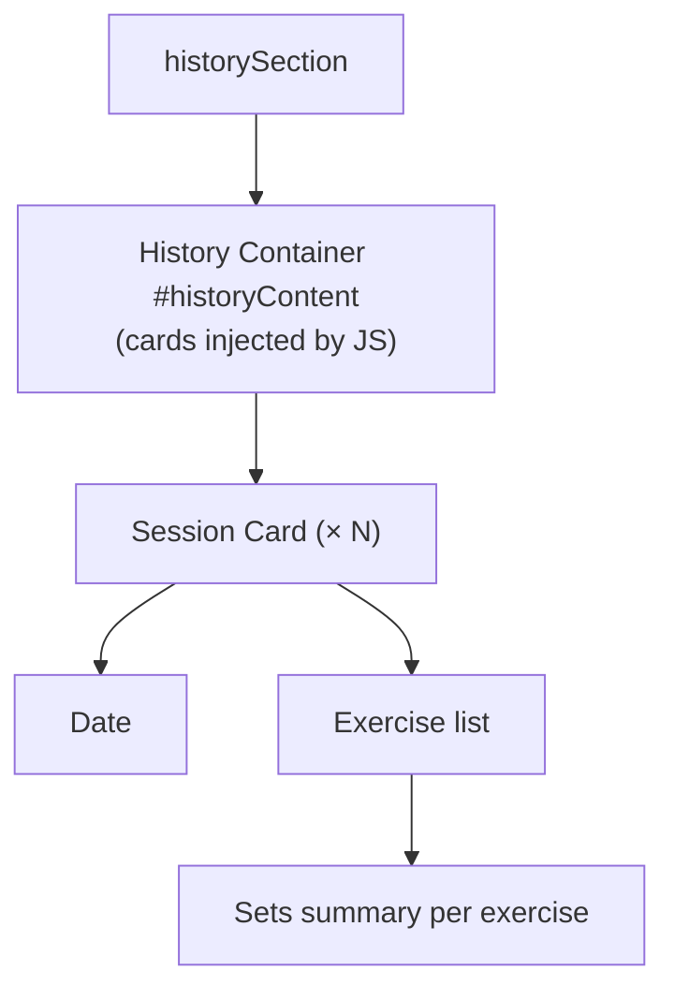

# History Tab

`historySection` in `index.html`.

---

## Layout

- **History Container** `#historyContent`
  - **Session Card** *(one per past workout, injected by JS)*
    - Date
    - Exercise list with sets summary

