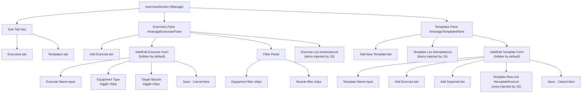

# Manage Tab

`exercisesSection` in `index.html`. Contains two sub-tabs.

---

## Sub-Tab Nav

| Tab | Pane |
|---|---|
| Exercises | `#manageExercisesPane` |
| Templates | `#manageTemplatesPane` |

---

## Exercises Pane

- Add Exercise button
- **Add / Edit Exercise Form** *(hidden by default)*
  - Exercise Name input
  - Equipment Type — toggle chip grid
  - Target Muscle — toggle chip grid
  - Save · Cancel buttons
- **Filter Panel**
  - Equipment filter chips
  - Target muscle filter chips
- **Exercise List** `#exerciseList` — items injected by JS

---

## Templates Pane

- Add New Template button
- **Template List** `#templateList` — items injected by JS
- **Add / Edit Template Form** *(hidden by default)*
  - Template Name input
  - Add Exercise button
  - Add Superset button
  - Template Row List `#templateRowList` — rows injected by JS
  - Save · Cancel buttons

---

