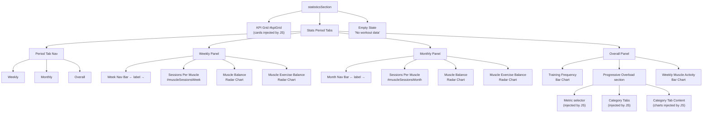

# Statistics Tab

`statisticsSection` in `index.html`.

---

## Layout

- **KPI Grid** `#kpiGrid` — summary cards injected by JS
- **Stats Period Tabs** — three panels, one active at a time
- **Empty State** — shown when there is no workout data

---

## Period Tabs

### Weekly

- Week navigation bar — ← current week label → (next disabled when at current week)
- Sessions Per Muscle `#muscleSessionsWeek` — injected by JS
- Muscle Balance — Radar chart
- Muscle Exercise Balance — Radar chart

### Monthly

- Month navigation bar — ← current month label →
- Sessions Per Muscle `#muscleSessionsMonth` — injected by JS
- Muscle Balance — Radar chart
- Muscle Exercise Balance — Radar chart

### Overall

- **Stats Overview Grid**
  - Training Frequency — Bar chart
  - Progressive Overload section
    - Metric selector (chart controls, injected by JS)
    - Category tabs (injected by JS)
    - Category tab content — charts injected per category
- Weekly Muscle Activity — Bar chart

---

