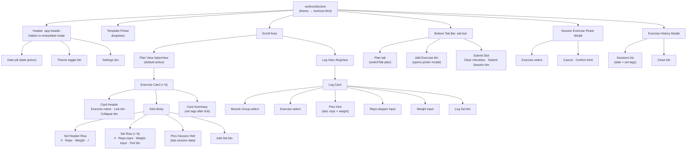
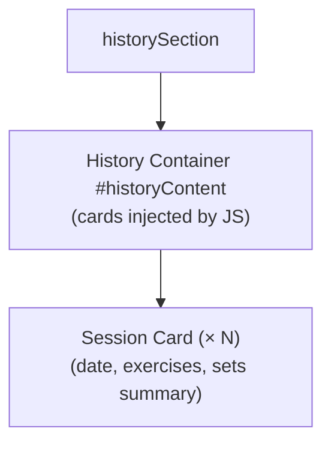
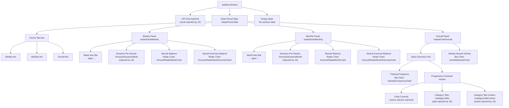
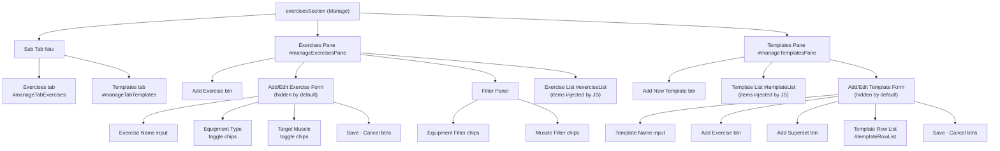
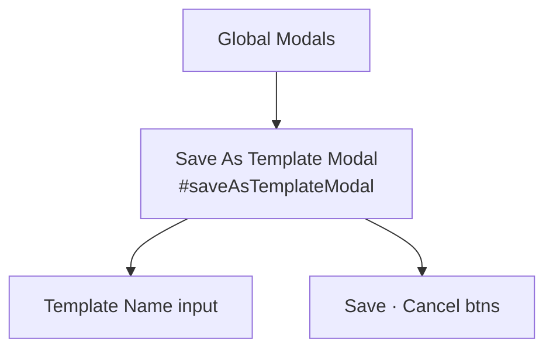

# UI Structure

Single-page app (`index.html`). A top-nav dropdown switches between four main sections. Each section is documented in its own file below.

## Sections

- [Workout](ui-workout.md) — active session board (embedded `workout.html`)
- [History](ui-history.md) — past session cards
- [Statistics](ui-statistics.md) — KPI grid and period-based charts
- [Manage](ui-manage.md) — exercise list and workout templates

---

## Top-Level Shell

- **Header** `.app-header`
  - Theme toggle button
  - Main nav dropdown
    - Workout
    - History
    - Statistics
    - Manage
    - Configuration *(collapsible)*
      - Mode toggle: Local | GitHub
      - GitHub config form: Token · Username · Repo · Save
      - Local controls: Sample Data · Clear Data
- **Main** `.app-content`
  - `workoutSection`
  - `historySection`
  - `statisticsSection`
  - `exercisesSection` (Manage)

---

## Global Modals

- **Save As Template** `#saveAsTemplateModal`
  - Template Name input
  - Save · Cancel buttons

---

## History Tab (`historySection`)

---

## Statistics Tab (`statisticsSection`)

---

## Manage Tab (`exercisesSection`)

---

## Global Modals (index.html)

