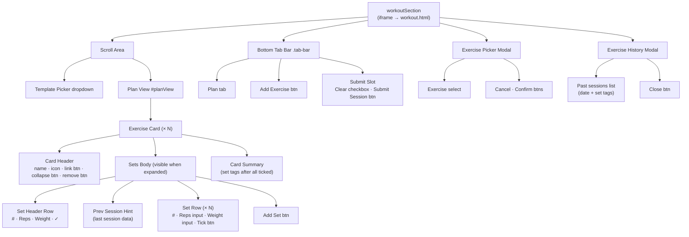

# Workout Tab

`workoutSection` in `index.html` — embeds `workout.html` in a full-height iframe.

The header inside `workout.html` is hidden when embedded (`.embedded-mode .app-header { display: none }`), so only the scroll area and footer are visible.

---

## Scroll Area

### Template Picker

- Dropdown button showing the active template name ("No template" when none selected)
- Template options list — selecting one clears the current board and loads the template's exercises

### Exercise Cards *(one per exercise, generated dynamically)*

```
.phone
└── .scroll-area
    └── #planView
        ├── .template-picker
        └── .exercise-card  (× N)
            ├── .card-header
            │   ├── .exercise-icon          equipment icon (dumbbell / user / gear)
            │   ├── .exercise-name          name + muscle chip + "(Completed)" pill
            │   ├── .link-next-btn          superset link toggle
            │   ├── .collapse-btn           expand / collapse the sets body
            │   └── .remove-ex-btn          delete card (trash icon)
            ├── .sets-body  (visible when expanded)
            │   ├── .set-header-row         # · Reps · Weight · ✓  (Weight column hidden for bodyweight)
            │   ├── .prev-hint              "Last session: …" — tap to open history modal
            │   ├── .set-row  (× N)
            │   │   ├── .set-num            1, 2, 3 …
            │   │   ├── .reps-cell          − [reps input] +
            │   │   ├── .weight-input       weight input  (absent for bodyweight exercises)
            │   │   └── .tick-btn           ✓ marks set complete
            │   └── .add-set-btn            "+ Add Set" button
            └── .card-summary              set tags e.g. "4×80kg" (shown after all sets ticked)
```

When all sets in a card are ticked:
- Card auto-collapses
- Exercise name gets a "(Completed)" pill
- `.card-summary` shows a tag for each set

---

## Footer — Bottom Tab Bar

```
.tab-bar
├── #tab-plan         Plan
├── #tab-add          Add Exercise  →  opens exercise picker modal
└── .submit-slot
    ├── .clear-check  [ ] Clear     checkbox — clears board after submit when checked
    └── #submitBtn    Submit Session  (disabled until at least one set is ticked)
```

---

## Modals

### Exercise Picker *(opens from Add Exercise)*
- Exercise select dropdown (lists exercises not already on the board)
- Cancel · Confirm buttons

### Exercise History *(opens by tapping a previous-session hint row)*
- Exercise name title
- Scrollable list of past sessions — each shows date + set tags (e.g. "4×80 kg")
- Close button

---


